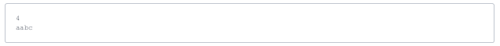
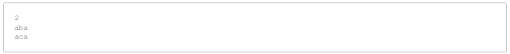
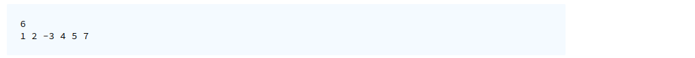
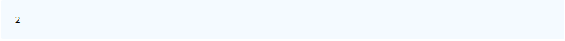

## Limak and palindromes 2 ! 

Limak likes palindromes and recently he came across a simple problem in which he was given a string and he had to report the total number of unique palindromes of length 3 which can be formed by using the characters of the string. Also, he was supposed to list out in lexicographical order all the palindromes of length 3 with each palindrome in a separate line.

**Input Format**

The first line of input contains the length of the string and it is followed by a string of the above mentioned length. **Constraints**

1 <= length of string <= 100000

The string consists of lowercase alphabets

**Output Format**

The first line of input should be an integer which is the total number of unique palindromes of length 3 which can be formed by using the characters in the string. The following lines consist of all unique palindromes of length 3 which are arranged in lexicographical order and can be formed using the characters in the string.

**Sample Input 0**\
4\
aabc\

**Sample Output 0**\
2\
aba\
aca\

**Explanation 0**
In this sample test case, we can form two palindromes of length 3 by using the characters in the string. When printed in lexicographical order, aba and aca is printed.

       =================================================================================

## Andrew and Maximal Negated Subarray 

Andrew likes solving problems and dealing with prime numbers. He recently came across a problem in which he was given a list of numbers and he was supposed to find out a subarray from this list which starts and ends in a prime number and which has minimum count of negative numbers in it. In case two or more such subarrays have the same minimum count of negative numbers then please report an array which has the maximum length from the two.

**Note: The length of the subarray is inclusive of both the starting and ending prime numbers. Input Format**

The first line of input contains an integer n which is the total elements in the list. The following line contains space separated n integers.

**Constraints**

1 <= N <= 10000

-10000 <= element <= 1000000

**Output Format**

Print a single integer which is the length of the subarray which starts and ends with a prime number and has the least count of negative numbers. In case two or more subarrays have the same count of negative numbers, then print the length of the bigger array.

**Sample Input 0**

6

1 2 -3 4 5 7

**Sample Output 0**

2

**Explanation 0**

In this sample test case, the subset between 2 and 5 has one negative number whereas the subset between 5 and 7 has no negative number hence the length of subset from 5 and 7 with both of them as inclusive is 2.
